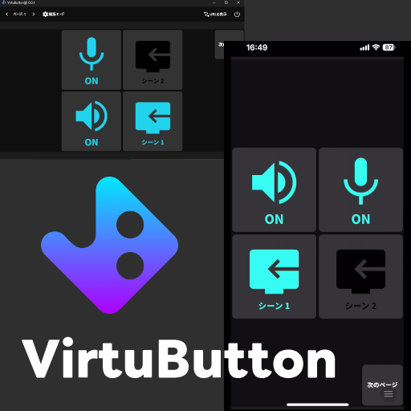

# VirtuButton

- **現在ベータ版として公開しています。**
- **大幅な変更が加わる可能性があります。**

ダウンロードはこちら↓

[VirtuButton/releases](https://github.com/totoraj930/VirtuButton/releases)



スマホなどの外部デバイスからPCを操作できるようにするアプリケーションです。

VirtuButton(ばーちゅボタン)は"Virtual(仮想)"な"Button(ボタン)"という意味です。

ボタンは自由に追加したりカスタマイズしたりできます。

使い方はあなた次第！遊んでみてね😉

## プラグインについて

VirtuButtonではプラグインを追加することで他のアプリケーションなどと連携することができます。

プラグインはTypeScriptで簡単に作ることができるようになっています。(Node.js上で動作します)

詳細なドキュメントなどは随時追加予定です。

### 現状あるプラグイン

- OBSプラグイン(v0.0.3時点ではビルトインだけど分離するかも)
- [Discordプラグイン](https://github.com/totoraj930/VB-DiscordPlugin)(導入方法がちょっと難しい)

## 開発

- node >= 20
- pnpm >= 9

クローンして下記のようにすれば動くはず…多分

```shell
# パッケージのインストール
pnpm install
# スマホ用ページのビルド
pnpm app build:remote
# 開発用の起動
pnpm app dev
```

### ディレクトリの説明

pnpmのworkspaceを用いたモノレポっぽい構成になっています。

```
.
├── /app/ - Electronアプリ本体/
│   ├── /src/ - BrowserWindowで表示される部分
│   ├── /src-electron/ - いわゆるバックエンド(Node.js上で動作する)
│   └── /src-remote/ - スマホに表示される部分(ビルドしたものがhonoでホスティングされる)
├── /common/ - プラグインなどからも使う共通型など/
│   ├── /src/ - ソースコード
│   └── /dist/ - 外部からpnpm addするためにビルド済みファイルもgitに含めています
└── /docs/ - vb.totoraj.netで公開されるGithub Pagesになる予定
```


## 利用規約

**すべて自己責任でお願いします。**

(ちゃんとした利用規約は後日用意します🙇)

## ライセンス

MIT

## 著者

- Reona Oshima (totoraj)
  - X(Twitter): [@totoraj_game](https://x.com/totoraj_game)